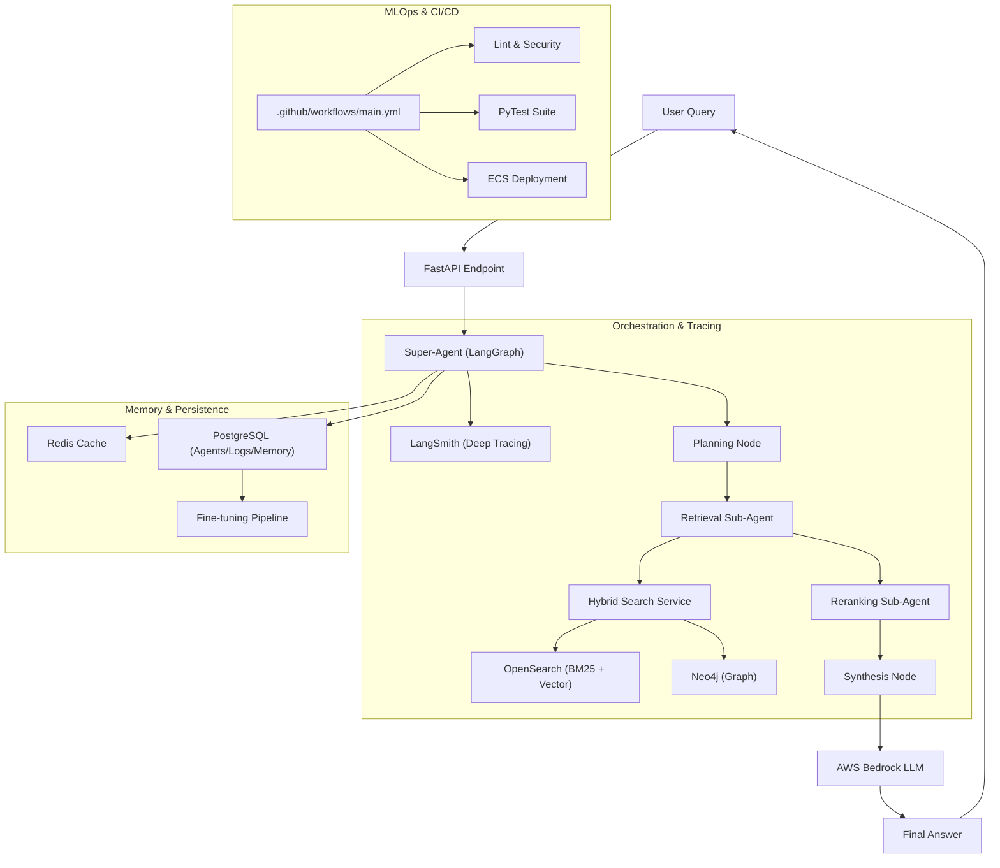

## Monitoring & Tracing
Integrated **LangSmith** provides visibility into:
- Agent planning logic and task assignment.
- Sub-agent latency and execution IDs.
- Input/Output traces for all Bedrock calls.
- Cost tracking per query session.
