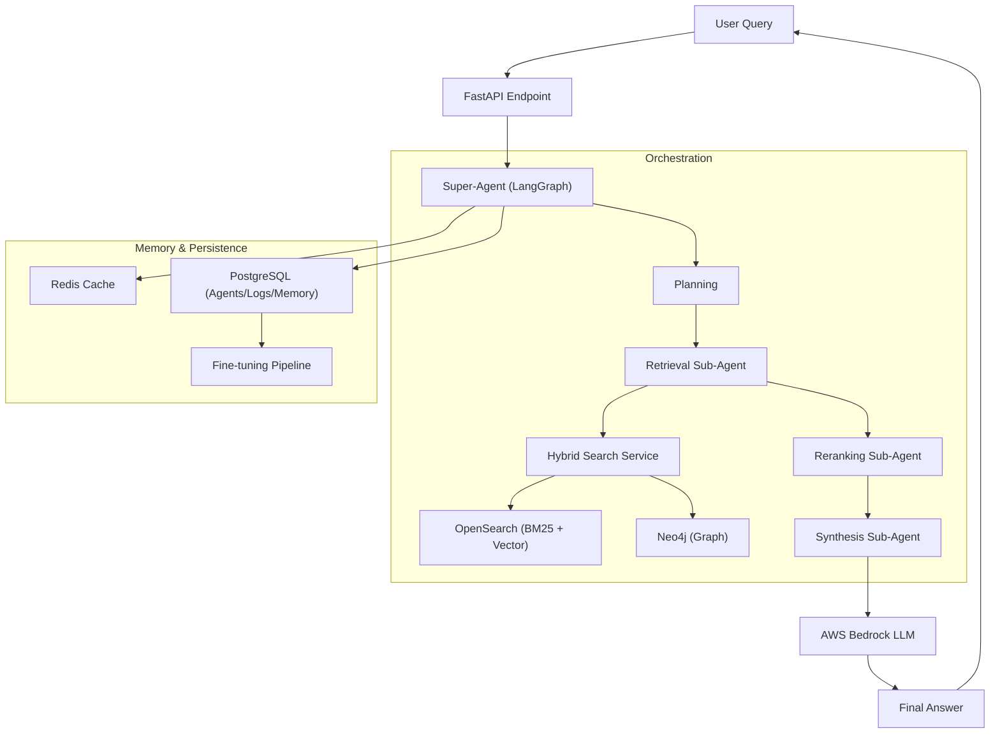

# Architecture Overview

## Workflows
1. **Query Processing**: User submits a query -> Super-Agent plans -> Sub-agents retrieve and rerank -> LLM synthesizes answer.
2. **Memory Management**: Sessions are tracked; expired memories are auto-deleted.
3. **Audit Trail**: Every execution is logged to PostgreSQL and CloudWatch with unique Trace IDs.
